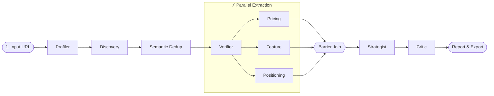

# Flank

> One input: your product's URL. One output: a live, fully-cited competitive intelligence report with pricing, positioning, feature matrices, and actionable edge opportunities.

---

## What It Does

Paste your product URL. Flank discovers your real market competitors across the open web, reads their pricing and feature pages, normalizes everything into a comparable format, and delivers an auditable market dossier:

- **Verified Competitors** — Automatically discovered and classified (direct, indirect, adjacent, substitute)
- **Side-by-Side Pricing** — Normalized plans, tiers, limits, and add-ons across cadences and currencies
- **Positioning 2×2 Map** — Verbatim hero messaging, ICP analysis, and whitespace opportunity clusters
- **Feature Matrix** — Normalized taxonomy with gap analysis and market coverage percentages
- **Ranked Edge Opportunities** — Concrete strategic moves with effort/impact scores and defensibility notes

Every single fact links directly to an immutable source snapshot. Nothing is asserted without evidence.

---

## Core Loop



Re-running on the same target produces a **diff** against the previous run — not a duplicate report.

---

## Tech Stack

| Layer              | Technology                        | Role                                                    |
| ------------------ | --------------------------------- | ------------------------------------------------------- |
| **App Framework**  | Next.js (App Router) + TypeScript | React Server Components, BFF API route handlers         |
| **Database**       | Postgres 16 + Prisma              | Neon Postgres (Prisma client, single source of truth)   |
| **Vector Search**  | pgvector (HNSW index)             | Semantic competitor deduplication via Gemini embeddings |
| **Queue & Cache**  | Redis + BullMQ                    | Upstash Redis for asynchronous DAG stage execution      |
| **Worker Runtime** | Standalone Node.js                | Fly.io worker running autonomous agent stages           |
| **Object Storage** | Cloudflare R2                     | SHA-256 content-hash addressed HTML page snapshots      |
| **LLM Engine**     | Vercel AI SDK                     | Provider-agnostic (Google Gemini default)               |
| **Web Extraction** | HTTP Reader + Playwright          | Public web scraping with `robots.txt` compliance        |

---

## Architecture & Invariants

```
apps/
  app/        — Next.js (BFF + UI). The browser talks here and nowhere else.
  worker/     — Standalone Node process. All LLM, scraping, and DAG logic lives here.

packages/
  shared/     — Zod contracts, stage payloads, provider interfaces, and domain schemas.
  database/   — Prisma schema and database client.
  evals/      — Golden-set fixtures and regression evaluation harness.
```

- **BFF Boundary**: The browser never communicates directly with Redis, workers, or LLM providers.
- **Dependency-Driven DAG**: Independent extractions (`Pricing`, `Feature`, `Positioning`) run concurrently upon verification, cutting latency from ~80s to ~39s.
- **5-Layer Prompt Architecture**: Static prefix caching (System, Few-Shots, Tool Spec) with dynamic Layer 4 context cuts token costs and latency by 70%.
- **Dual Memory & Change Detection**: In-context working memory is seeded from persistent storage. Scrapes use SHA-256 hashes and HTTP 304 conditional revalidation to trigger market change alerts.
- **Deterministic Quality Gates**: The Critic enforces evidence coverage rules with a hard 2-retry budget to prevent infinite loops.

---

## Quickstart

### Prerequisites

- Node.js 20+
- pnpm 9+
- Docker (optional for local Postgres)

### Setup

```bash
# 1. Clone and install dependencies
git clone https://github.com/tyraakj/flank.git
cd flank
pnpm install

# 2. Configure environment variables
cp .env.example .env

# 3. Start database and run migrations
docker compose -f infra/docker-compose.yml up -d
pnpm db:migrate

# 4. Start app and worker in development
pnpm dev
```

### Common Commands

```bash
pnpm typecheck      # Type-check all workspace packages
pnpm test           # Run unit test suites
pnpm db:studio      # Open Prisma Studio visual database editor
```

---

## Documentation

Full architectural specifications, data models, and agent workflows are maintained in [`context/`](./context/):

- [`context/project-overview.md`](./context/project-overview.md) — Product definition and roadmap
- [`context/architecture-context.md`](./context/architecture-context.md) — System boundaries and invariants
- [`context/code-standards.md`](./context/code-standards.md) — Prompt conventions and development rules
